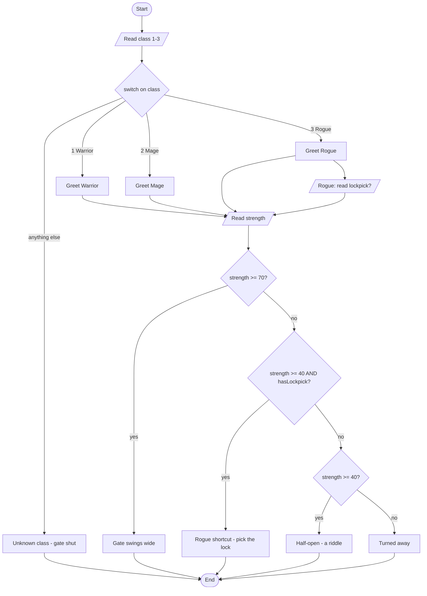

# M4 Apply: The Dungeon Gatekeeper

## What We're Building

A gatekeeper stands at the dungeon door. Before she lets you in, she asks your
class, sizes up your strength, and — if you're a Rogue — checks whether you
brought a lockpick. Depending on your answers, the gate swings wide, opens
halfway with a riddle, gives a clever Rogue a shortcut, or stays shut.

You'll type the whole program yourself, in four stages. Each stage compiles
and runs on its own, so you always have a working program in front of you. By
the end you'll have used every M4 tool: a `switch`, an `if` / `else if` / `else`
ladder, and a compound condition with `&&`.

Here's the finished program's decision logic as a flowchart. You'll build code
that matches it, one diamond at a time:



And here's one full sample run (a Rogue, strength 50, carrying a lockpick):

```text
A gatekeeper blocks the dungeon door. She looks you over.
Your class? (1 = Warrior, 2 = Mage, 3 = Rogue): 3
"A Rogue. Keep your hands where I can see them."
Your strength score (0-100): 50
"A Rogue, hm. Do you carry a lockpick? (1 = yes, 0 = no): "1
"Not strong — but those clever hands might do."
She looks away. You pick the lock and slip inside.
The visit ends.
```

> Note: see the `1` sitting right against `no): "` with no space in front of
> it? That's your keystroke echoing to the screen as you type it — it lands
> right where the cursor is, not after a space. That's not a formatting mistake.

---

## Instructor Notes

**Mode: FULL (type-in 100%).** M4 is the last module at this position —
students type every character; nothing is pre-filled. Do not paste the listing
into a file for them. The listings live in this document only; students read
them here and type into their own `.cpp`.

**Timing (≈50 min).** Stage 1 ~8, Stage 2 ~12, Stage 3 ~12, Stage 4 ~12,
deliberate break ~5, wrap-up ~3. **Halfway mark is the end of Stage 2** (the
`switch` compiles and runs, ~20 minutes in). If you're behind there, trim the
predict discussion in Stages 3–4, not the typing.

**The one new idea per stage.** Stage 2 is the `switch`. Stage 3 is the
`if` / `else if` / `else` ladder. Stage 4 is the compound condition (`&&`).
Everything before Stage 4 is a single condition at a time; the `&&` is
introduced last, on purpose, as its own stage — so it's taught, never sprung.

**Where students typically stall (per stage):**

- *Stage 2 — `switch`.* Two classics. (1) Forgetting `break;` after a `case`
  — this is the **switch fall-through** trap; we hit it on purpose in optional
  Break C, and the compiler flags it (`-Wimplicit-fallthrough`), so a student who
  trips it early gets a preview and a readable warning, not a mystery.
  (2) Typing `case 1;` (semicolon) instead of `case 1:` (colon).
  The colon-vs-semicolon slip gives a **Syntax** error — let them read it.
- *Stage 3 — the ladder.* The big one is `=` vs `==`. Writing
  `if (strength = 70)` is legal C++ that assigns instead of comparing — a
  named M4 trap. Under our build flags (`-Wall`) the compiler *warns* about
  it, which under our zero-warning rule stops the build. Point at the warning;
  don't let them wave it past.
- *Stage 3 — dangling `else` / missing braces.* We always brace every
  `if` and `else` in this course. Fair warning: an `else` with no braces binds
  to the *nearest* `if`, not the one your indentation suggests — a silent
  **Logic** error. Braces prevent it. If a student drops the braces "to save
  typing," that's the trap; the fix is to put them back.
- *Stage 4 — the compound condition.* Students often want to write
  `strength >= 40 && hasLockpick == true`. It works, but `hasLockpick` is
  already a `bool`, so `&& hasLockpick` is enough. Also watch ladder order:
  the Rogue-shortcut branch must come *before* the plain `strength >= 40`
  branch, or the shortcut can never run (that would be a **Logic** error — an
  unreachable branch).

**Deliberate break:** at the end, students swap two branches in the outcome
ladder — putting `>= 40` above `>= 70` — and watch a strength-85 Warrior get the
borderline riddle instead of the open gate. **It compiles with zero warnings**,
and that is the whole point: a clean compile is not a correct program. Full
script below.

> **Why this demo and not the missing `break;`.** The fall-through demo used to
> live here, and it was wrong. Under `-Wall -Wextra` on **GCC** — which is what
> Codespaces runs — a missing `break;` produces `warning: this statement may fall
> through [-Wimplicit-fallthrough=]`. It only looks silent on Apple clang, which
> does not turn that warning on. **All three of M4's named traps are caught by
> our flags**; the mis-ordered ladder is not, which is what makes it the honest
> closer. Fall-through moved to the optional breaks, where the
> compiler-catches-it lesson now lives. See
> `_lore/findings/F-009-fallthrough-warning-claim-is-toolchain-dependent.md`.

**Theme note (instructor-facing).** The gatekeeper is this beat's worked skin.
The Assess lab lets students re-skin it (a nightclub bouncer, an airport gate
agent, a loan officer) — the decisions stay identical. Keep the theme loose as
you teach; nothing about the logic depends on dragons.

---

## Stage 1: The Gate (~8 min)

Start with the smallest program that runs: the includes, `main`, and the
gatekeeper's opening line. This verifies everyone's compiler works before we
add any decisions.

Have students type this exactly:

```cpp
#include <iostream>
using namespace std;

int main()
{
    // ===== STAGE 1: the gatekeeper greets you =====
    cout << "A gatekeeper blocks the dungeon door. She looks you over.\n";

    return 0;
}
```

**Predict first.** Ask the room: "What single line will this print?"

**Build and run:**

```bash
g++ -std=c++17 -Wall -Wextra -o apply-gatekeeper apply-gatekeeper.cpp
./apply-gatekeeper
```

**Expected output:**

```text
A gatekeeper blocks the dungeon door. She looks you over.
```

If that compiled with zero warnings and printed one line, the toolchain is
good and we can start making decisions.

> Note: we're using `using namespace std;` on purpose in this course, so it's
> `cout`, not `std::cout`. And `\n` at the end of a string is a newline — same
> as `endl` for our purposes here.

---

## Stage 2: She Asks Your Class — `switch` (~12 min)

Now the first decision. The gatekeeper asks your class and reacts to it. A
`switch` is the right tool when you're checking one variable against a short
list of exact values (1, 2, 3).

Add the marked lines:

```cpp
#include <iostream>
using namespace std;

int main()
{
    // ===== STAGE 1: the gatekeeper greets you =====
    cout << "A gatekeeper blocks the dungeon door. She looks you over.\n";

    // ===== STAGE 2: she asks your class (switch) =====        // NEW
    int characterClass = 0;   // 1 = Warrior, 2 = Mage, 3 = Rogue   // NEW
    cout << "Your class? (1 = Warrior, 2 = Mage, 3 = Rogue): ";   // NEW
    cin >> characterClass;                                        // NEW
                                                                  // NEW
    switch (characterClass)                                       // NEW
    {                                                             // NEW
        case 1:                                                   // NEW
            cout << "\"A Warrior. Strong arms, I hope.\"\n";      // NEW
            break;                                                // NEW
        case 2:                                                   // NEW
            cout << "\"A Mage. Let us see if the mind is as sharp as the robes.\"\n";  // NEW
            break;                                                // NEW
        case 3:                                                   // NEW
            cout << "\"A Rogue. Keep your hands where I can see them.\"\n";  // NEW
            break;                                                // NEW
        default:                                                  // NEW
            cout << "\"I do not know that class. Off you go.\"\n"; // NEW
            cout << "The gate stays shut. (Unknown class.)\n";    // NEW
            return 0;   // single pass — one bad answer ends the visit  // NEW
    }                                                             // NEW

    return 0;
}
```

Point out three things as they type:

- Each `case` ends with `break;`. That's what stops the code from sliding into
  the next case. We'll prove why it matters in the optional breaks below — and
  you'll see the compiler catch it for you.
- `case 1:` uses a **colon**, not a semicolon. `case 1;` is a **Syntax** error.
- `default:` is the "none of the above" branch. Here it prints a message and
  `return 0;` — the gatekeeper turns away an unknown class and the visit ends.
  That's a *designed* branch, not a crash.

**Predict first.** Ask: "If I type `2`, what does she say? What if I type `9`?"

**Build and run:**

```bash
g++ -std=c++17 -Wall -Wextra -o apply-gatekeeper apply-gatekeeper.cpp
./apply-gatekeeper
```

**Expected output — typing `1`:**

```text
A gatekeeper blocks the dungeon door. She looks you over.
Your class? (1 = Warrior, 2 = Mage, 3 = Rogue): 1
"A Warrior. Strong arms, I hope."
```

**Expected output — typing `9` (the `default` branch):**

```text
A gatekeeper blocks the dungeon door. She looks you over.
Your class? (1 = Warrior, 2 = Mage, 3 = Rogue): 9
"I do not know that class. Off you go."
The gate stays shut. (Unknown class.)
```

That's the halfway mark. Everyone should have a compiling `switch`.

---

## Stage 3: She Measures Your Strength — `if` / `else if` / `else` (~12 min)

A `switch` checks exact values. But strength is a *range* — "70 or more,"
"40 to 69," "under 40." Ranges are what an `if` / `else if` / `else` ladder is
for. The ladder checks conditions top to bottom and runs the **first** one
that's true, then skips the rest.

Add the marked lines below the `switch`'s closing brace:

```cpp
    // ... Stage 2 switch ends with its closing brace above ...

    // ===== STAGE 3: she measures your strength (if / else-if / else) =====   // NEW
    int strength = 0;         // a whole number, 0 to 100                       // NEW
    cout << "Your strength score (0-100): ";                                    // NEW
    cin >> strength;                                                            // NEW
                                                                                // NEW
    if (strength >= 70)                                                         // NEW
    {                                                                           // NEW
        cout << "The gate swings wide. \"Strong enough. Go through.\"\n";       // NEW
    }                                                                           // NEW
    else if (strength >= 40)                                                    // NEW
    {                                                                           // NEW
        cout << "\"Borderline. Answer me this and the gate is yours:\"\n";      // NEW
        cout << "\"What must be broken before you can use it?\"\n";             // NEW
        cout << "(Answer it in your head — the gate waits, half-open.)\n";      // NEW
    }                                                                           // NEW
    else                                                                        // NEW
    {                                                                           // NEW
        cout << "\"Too weak, and no trick to make up for it. Turned away.\"\n"; // NEW
    }                                                                           // NEW
                                                                                // NEW
    cout << "The visit ends.\n";                                                // NEW
    return 0;
}
```

Two things to stress here:

- **Order matters.** We check `>= 70` first, then `>= 40`. If you flipped them,
  a strength of 85 would match `>= 40` first and never reach the `>= 70` line.
  Highest bar first.
- **Braces every time.** Every `if`, `else if`, and `else` gets `{ }`, even
  when the body is one line. This is how we avoid the *dangling else* — an
  `else` accidentally attaching to the wrong `if`. Braces make it unambiguous.

**Predict first.** Ask: "Class `1`, strength `55` — which branch?" Then:
"Strength `20`?"

**Build and run:**

```bash
g++ -std=c++17 -Wall -Wextra -o apply-gatekeeper apply-gatekeeper.cpp
./apply-gatekeeper
```

**Expected output — class `1`, strength `55`:**

```text
A gatekeeper blocks the dungeon door. She looks you over.
Your class? (1 = Warrior, 2 = Mage, 3 = Rogue): 1
"A Warrior. Strong arms, I hope."
Your strength score (0-100): 55
"Borderline. Answer me this and the gate is yours:"
"What must be broken before you can use it?"
(Answer it in your head — the gate waits, half-open.)
The visit ends.
```

**Expected output — class `1`, strength `20`:**

```text
A gatekeeper blocks the dungeon door. She looks you over.
Your class? (1 = Warrior, 2 = Mage, 3 = Rogue): 1
"A Warrior. Strong arms, I hope."
Your strength score (0-100): 20
"Too weak, and no trick to make up for it. Turned away."
The visit ends.
```

---

## Optional: Three Quick Breaks — the ones the compiler catches

Three "break it on purpose" experiments, all **optional** — skip them if the
clock is tight. Each is a one-spot edit to the program you have right now.
**Restore the original before you go on to Stage 4.**

What ties them together: **every one of these gets caught by `-Wall -Wextra`.**
The compiler sees all three coming and says so. That is worth feeling directly,
because the deliberate break at the end of the session is the one it *cannot*
see — and the contrast is the real lesson.

### Break A: `=` instead of `==` (~2 min)

Find your strength check `if (strength >= 70)`. Change the `>=` to a single
`=` — one character — so the line reads:

```cpp
    if (strength = 70)     // one character changed on purpose
```

**Predict first.** Ask: "Will this even compile?"

**Build and run.** It won't build — under `-Wall` the compiler stops on a
warning, and our zero-warning rule treats that as a failed build:

```text
warning: suggest parentheses around assignment used as truth value [-Wparentheses]
```

A single `=` *assigns* 70 into `strength` instead of comparing against it — it
would quietly overwrite the score and force the branch. The compiler is
flagging a **Logic** error before it can bite you.

**The fix:** put the `>=` back. (Same slip to remember with `==`: a comparison
is two equals signs, never one.) Rebuild and confirm it's clean again.

### Break B: drop the braces (dangling `else`) (~3 min)

We brace every branch in this course for a reason — here's the reason. For a
single run, replace your **whole strength `if / else if / else` block** with
this nested, brace-free version (delete all of it, paste this in its place). The
indentation says one thing; watch C++ do another:

```cpp
    // TEMPORARY — braces removed on purpose
    if (strength >= 40)
        if (strength >= 70)
            cout << "The gate swings wide. \"Strong enough. Go through.\"\n";
    else
        cout << "\"Too weak, and no trick to make up for it. Turned away.\"\n";
```

**Predict first.** Ask: "Strength `50` — the indenting lines the `else` up with
`strength >= 40`, so what should print?"

**Build it.** The compiler has something to say before you even run it:

```text
apply-gatekeeper.cpp: In function 'int main()':
apply-gatekeeper.cpp:60:8: warning: suggest explicit braces to avoid ambiguous 'else' [-Wdangling-else]
   60 |     if (strength >= 40)
      |        ^
```

Read that out loud: *suggest explicit braces to avoid ambiguous `else`.* The
compiler is telling you the exact thing this experiment exists to teach, before
you have run a single line. Under our zero-warning rule that is a failed build —
but it still produces a program, which is why you can run it anyway.

(You may see a second warning about `hasLockpick` being set but not used. That's
honest too: pasting this block over the ladder removed the branch that used it.)

**Now run it — type class `1`, then strength `50`.** It prints *"Too weak...
Turned away."* A strength of 50 turned away?

The `else` bound to the **nearest** `if` — `if (strength >= 70)` — not the one
your indentation lined it up with. The grammar is fine, so the program builds and
runs; it just does the wrong thing. That's a **Logic** error, and it's exactly
why we wrap every branch in `{ }`.

**The fix:** restore your braced `if` / `else if` / `else` ladder from Stage 3.
Rebuild, type strength `50`, and confirm you're back to the half-open riddle —
and that the warnings are gone.

### Break C: the missing `break;` (~3 min)

Find `case 1:` in your `switch`. Delete or comment out the `break;` right below
its `cout` line. Leave everything else alone.

```cpp
        case 1:
            cout << "\"A Warrior. Strong arms, I hope.\"\n";
            // break;   <-- deliberately removed
        case 2:
```

**Predict first.** Ask: "Will this even build? If it runs, what does a Warrior
see?"

**Build it.** The compiler catches this one too:

```text
apply-gatekeeper.cpp: In function 'int main()':
apply-gatekeeper.cpp:30:21: warning: this statement may fall through [-Wimplicit-fallthrough=]
   30 |             cout << "\"A Warrior. Strong arms, I hope.\"\n";
      |                     ^~~~~~~~~~~~~~~~~~~~~~~~~~~~~~~~~~~~~~~
apply-gatekeeper.cpp:32:9: note: here
   32 |         case 2:
      |         ^~~~
```

Note the `note: here` line pointing at `case 2:`. The compiler is showing you
both ends of the problem: where control falls *from* and where it falls *to*.
That is a warning worth learning to read, because it names the bug precisely.

**Run it anyway — type `1` (Warrior), then `90`:**

```text
A gatekeeper blocks the dungeon door. She looks you over.
Your class? (1 = Warrior, 2 = Mage, 3 = Rogue): 1
"A Warrior. Strong arms, I hope."
"A Mage. Let us see if the mind is as sharp as the robes."
Your strength score (0-100): 90
The gate swings wide. "Strong enough. Go through."
The visit ends.
```

A Warrior got greeted as a Warrior **and** a Mage. Without the `break;`, `case 1`
finished and kept going into `case 2` — that's **switch fall-through**, and it is
a **Logic** error: the program built, it ran, it just did what you said instead of
what you meant.

**The fix:** put the `break;` back. Rebuild, confirm the warning is gone and the
Warrior only hears the Warrior line.

---

## Stage 4: The Rogue's Lockpick — a Compound Condition `&&` (~12 min)

Last idea: a Rogue with a lockpick gets a shortcut *even without* the full
strength. That needs **two things to be true at once** — the strength is at
least 40 **and** they have a lockpick. That's the `&&` operator: "both."

First, only Rogues get asked about the lockpick, so we ask inside an `if`.
Then we add a new branch to the ladder that uses `&&`.

Insert the lockpick block right after `cin >> strength;`, and add the new
`else if` branch into the ladder (marked lines):

```cpp
    // ===== STAGE 3: she measures your strength (if / else-if / else) =====
    int strength = 0;         // a whole number, 0 to 100
    cout << "Your strength score (0-100): ";
    cin >> strength;

    // ===== STAGE 4: a Rogue may carry a lockpick (compound condition) =====   // NEW
    bool hasLockpick = false;                                                   // NEW
    if (characterClass == 3)                                                    // NEW
    {                                                                           // NEW
        int answer = 0;       // 1 = yes, anything else = no                    // NEW
        cout << "\"A Rogue, hm. Do you carry a lockpick? (1 = yes, 0 = no): \""; // NEW
        cin >> answer;                                                          // NEW
        hasLockpick = (answer == 1);                                            // NEW
    }                                                                           // NEW

    if (strength >= 70)
    {
        cout << "The gate swings wide. \"Strong enough. Go through.\"\n";
    }
    else if (strength >= 40 && hasLockpick)                                     // NEW
    {                                                                           // NEW
        cout << "\"Not strong — but those clever hands might do.\"\n";          // NEW
        cout << "She looks away. You pick the lock and slip inside.\n";         // NEW
    }                                                                           // NEW
    else if (strength >= 40)
    {
        cout << "\"Borderline. Answer me this and the gate is yours:\"\n";
        cout << "\"What must be broken before you can use it?\"\n";
        cout << "(Answer it in your head — the gate waits, half-open.)\n";
    }
    else
    {
        cout << "\"Too weak, and no trick to make up for it. Turned away.\"\n";
    }

    cout << "The visit ends.\n";
    return 0;
}
```

Stress the two ideas:

- **`&&` means both.** `strength >= 40 && hasLockpick` is true only when the
  strength check passes **and** the Rogue has a lockpick. If either is false,
  the whole thing is false and we fall through to the next branch.
- **Branch order, again.** The `&& hasLockpick` branch comes **before** the
  plain `strength >= 40` branch. If it came after, a strength-50 Rogue with a
  lockpick would match the plain `>= 40` line first and never get the
  shortcut. A branch that can never run is a **Logic** error, not a style nit.

Now `characterClass` is used in Stage 4 too, so the whole program hangs
together — every variable is read and used.

**Predict first.** Ask: "Rogue, strength `50`, lockpick `1` — which branch?
Now the same Rogue with lockpick `0`?"

**Build and run:**

```bash
g++ -std=c++17 -Wall -Wextra -o apply-gatekeeper apply-gatekeeper.cpp
./apply-gatekeeper
```

**Expected output — Rogue `3`, strength `50`, lockpick `1`:**

```text
A gatekeeper blocks the dungeon door. She looks you over.
Your class? (1 = Warrior, 2 = Mage, 3 = Rogue): 3
"A Rogue. Keep your hands where I can see them."
Your strength score (0-100): 50
"A Rogue, hm. Do you carry a lockpick? (1 = yes, 0 = no): "1
"Not strong — but those clever hands might do."
She looks away. You pick the lock and slip inside.
The visit ends.
```

**Expected output — Rogue `3`, strength `50`, lockpick `0`:**

```text
A gatekeeper blocks the dungeon door. She looks you over.
Your class? (1 = Warrior, 2 = Mage, 3 = Rogue): 3
"A Rogue. Keep your hands where I can see them."
Your strength score (0-100): 50
"A Rogue, hm. Do you carry a lockpick? (1 = yes, 0 = no): "0
"Borderline. Answer me this and the gate is yours:"
"What must be broken before you can use it?"
(Answer it in your head — the gate waits, half-open.)
The visit ends.
```

Same Rogue, same strength — one word of difference in the answer sends them
down a different path. That's selection doing its job.

The program is complete. This matches the flowchart from the top of the
tutorial, diamond for diamond.

---

## The Deliberate Break (~5 min)

Every break you have done so far, the compiler saw coming. This one it cannot.

**Do this:** find your outcome ladder at the bottom of the program. Swap the
order of the first two bars — move the `>= 40` branch **above** the `>= 70`
branch. Change nothing else. No text, no conditions, just the order:

```cpp
    // TEMPORARY — branches swapped on purpose
    if (strength >= 40)
    {
        cout << "\"Borderline. Answer me this and the gate is yours:\"\n";
        cout << "\"What must be broken before you can use it?\"\n";
        cout << "(Answer it in your head — the gate waits, half-open.)\n";
    }
    else if (strength >= 70)
    {
        cout << "The gate swings wide. \"Strong enough. Go through.\"\n";
    }
```

**Predict first.** Ask: "A Warrior with strength `85` — that clears the top bar
easily. What does she say?"

**Build and run — type `1` (Warrior), then `85`:**

```bash
g++ -std=c++17 -Wall -Wextra -o apply-gatekeeper apply-gatekeeper.cpp
./apply-gatekeeper
```

**What actually happens — it compiles with zero warnings, then:**

```text
A gatekeeper blocks the dungeon door. She looks you over.
Your class? (1 = Warrior, 2 = Mage, 3 = Rogue): 1
"A Warrior. Strong arms, I hope."
Your strength score (0-100): 85
"Borderline. Answer me this and the gate is yours:"
"What must be broken before you can use it?"
(Answer it in your head — the gate waits, half-open.)
The visit ends.
```

A strength of **85** got the borderline riddle. She should have walked straight
through. And `85 >= 70` is obviously true — that line is sitting right there in
the program, spelled correctly, and it **never runs**. The ladder stops at the
first true branch, and `85 >= 40` was true first, so the gate branch is now
unreachable.

**Name the error class:** this is a **Logic** error. The grammar is fine. The
program ran fine — no crash, no complaint. It just did what you said, not what
you meant.

**And this time the compiler said nothing at all.** Zero warnings. That is the
difference worth taking away from today:

- The three optional breaks — `=` vs `==`, the dangling `else`, the missing
  `break;` — all got caught. `-Wall -Wextra` sees them and tells you.
- **This one is invisible to it.** Nothing is malformed. Every branch is
  reachable *grammatically*; one is just never reached in practice. No compiler
  can know which order you meant.

So: **a clean compile is not proof of a correct program.** It only proves the
grammar is fine. Whether the program does what you wanted is a question only
testing answers — which is why you ran it with `85` instead of trusting it.

**The fix:** put the `>= 70` branch back on top. Highest bar first, always.
Rebuild, type `1` and `85`, and confirm the gate swings wide.

---

## Wrap-Up

You built the whole Dungeon Gatekeeper by hand, and you used every M4 tool:

- a **`switch`** on an exact value (the class),
- an **`if` / `else if` / `else`** ladder on a range (the strength),
- a **compound condition** with **`&&`** (the Rogue's shortcut),
- and a **`default`** / **`else`** for the "none of the above" cases.

You also met the classic traps by name — **switch fall-through** (the missing
`break;`), the **dangling else** (why we brace everything), and the `=` vs `==`
slip. The compiler warns you about all three, which is worth knowing: those
warnings are not noise, they are the compiler doing the job you would otherwise
do by hand.

And you met the one it **can't** warn you about — a ladder in the wrong order,
where a perfectly correct-looking branch simply never runs. That is the one that
needs you.

**What the Assess lab asks next.** The lab hands you a spec and asks you to
build your *own* decision program in this same shape — a `switch` on one input,
an `if` / `else if` / `else` ladder on another, at least one compound
condition, and a flowchart drawn *first* that matches your finished code. You
can keep the gatekeeper skin or re-skin it entirely (a bouncer at a club, a
gate agent at an airport, a loan officer at a bank) — the decisions are what's
graded, not the dragons. Draw the flowchart before you type, the way this
program matches the flowchart above, and you're already most of the way there.
```
