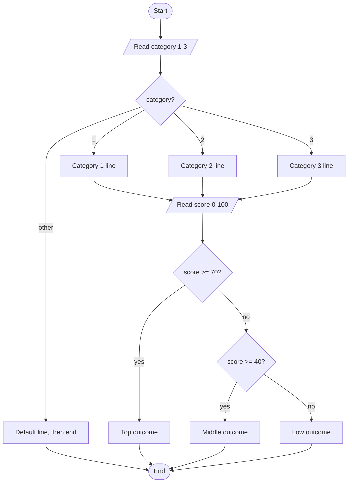

# M4LAB: The Crossing — A Decision Scene

## The Mission

In the Apply tutorial you typed in the Gatekeeper: a scene where a character
looks you over, asks a question or two, and then *decides* what happens to you.
Now you write your own.

You're building a single scene where the program makes real choices. Someone
stands in your way. They check who you are. They check something about you — a
number, a score, a count. Then the program picks one ending out of several,
based on what you typed. Same input, same ending, every time. Different input,
different ending. That's what decisions do: they make the program *fork*.

The Gatekeeper is one skin. You don't have to keep it. A nightclub bouncer
checking your ID and the guest list. An airport gate agent checking your ticket
class and your bag weight. A loan officer checking your account type and your
credit score. Pick whatever scene you like — the decisions underneath are the
same, and the decisions are what you're graded on.

## Specification

This is the contract. Read it with the theme words removed and it still tells
you exactly what to build.

**Inputs (typed by the user, in this order):**

1. A **category** — a whole number `1`, `2`, or `3` that picks *who* or *what
   kind*. (Warrior/Mage/Rogue, or Merchant/Pilgrim/Smuggler, or
   Standard/Business/First — your call.)
2. A **score** — a whole number from `0` to `100` that the program compares
   against thresholds.
3. *(Higher tiers only)* one more small input — a yes/no answer (`1` or `0`)
   that only some categories are asked for.

**Processing:**

- A **`switch`** on the category prints a category-specific line. A category
  number the `switch` doesn't recognize lands in the **`default`** case, which
  prints a "you don't belong here" line and ends the program cleanly. That
  `default` is a *designed* ending, not a crash.
- An **`if` / `else if` / `else` chain with at least three branches** compares
  the score against thresholds and picks the outcome. Order the branches from
  the highest bar down to the lowest, so each `else if` only runs when the ones
  above it were false. The threshold *values* are yours to choose — they need
  not match the example numbers (`70`, `40`) used here. The only rule is highest
  bar first.

**Outputs:**

- The category line, then the outcome line(s). Every run ends with exactly one
  outcome. No run should fall off the end with nothing printed.

**Sample run (C tier, Gatekeeper skin):**

```
A gatekeeper blocks the door. She looks you over.
Your class? (1 = Warrior, 2 = Mage, 3 = Rogue): 1
"A Warrior. Strong arms, I hope."
Your strength score (0-100): 85
The gate swings wide. "Strong enough. Go through."
The visit ends.
```

**Sample run (C tier, the default ending):**

```
A gatekeeper blocks the door. She looks you over.
Your class? (1 = Warrior, 2 = Mage, 3 = Rogue): 7
"I do not know that class. Off you go."
The gate stays shut.
```

The spec above is the whole target. The scene words are yours to change; the
`switch`, the three-branch chain, and the graceful `default` are not.

## Design First — draw the flowchart before you write code

**This is required, and it's graded at C tier.** Before you write a single
line of C++, draw a flowchart of your scene as a Mermaid diagram in
`m4lab-plan.md`. Your code must then match the flowchart you drew — same
decisions, same order, same endings.

Here's a model flowchart for the C-tier shape (Gatekeeper skin). Yours will
have your own scene's words, but this is the shape to aim for:



A diamond `{ }` is a decision. A `[/ /]` box is an input. A rounded `([ ])` box
is a start or end. Draw one diamond for each `if` / `switch` in your program.
Check that your Mermaid block actually renders on GitHub before you submit — a
broken diagram is an unfinished design.

## Traps named up front — no gotchas

These three mistakes are the classic ones for this kind of program. We're
naming them now, on purpose, so none of them can spring on you later. If one
shows up in your testing, you were warned, and you'll know exactly what it is.

- **`=` vs `==` in a condition.** One equals sign *assigns*; two equals signs
  *compare*. `if (score = 70)` sets `score` to 70 and is always "true" — almost
  never what you meant. It compiles (with a `-Wall` warning) and runs, so it's a
  **Logic** error: the code does what you wrote, not what you meant. Treat that
  warning as a lucky hint — fix it, don't silence it. Memory trick: *one equals
  gives, two equals asks.*
- **The dangling `else`.** Without braces, an `else` attaches to the *nearest*
  `if` above it, not the one your indentation suggests. The code compiles and
  runs — it just takes the wrong branch. That's a **Logic** error, the quiet
  kind. Put `{ }` braces around every branch body and it can't happen.
- **`switch` fall-through.** Forget a `break;` after a `case` and the program
  keeps running into the next case too. Also a **Logic** error. Put a `break;`
  after every `case` body (the `default` at the end doesn't need one, but it
  never hurts).

## Requirements by Tier

Tiers nest: B includes all of C, A includes all of B. You can stop at C with a
complete, working, submittable program — C is the objective met, not partial
credit.

### C Tier — the core scene (this is a passing lab)

Everything here, all working:

- [ ] A **flowchart** in `m4lab-plan.md`, drawn as a Mermaid diagram, matching
      your finished code.
- [ ] A **`switch`** on the category input with **at least three `case`s** plus
      a **`default`** that ends the program gracefully.
- [ ] An **`if` / `else if` / `else` chain with at least three branches** on the
      score (a high case, a middle case, a low case).
- [ ] Every branch is reachable and every run prints exactly one outcome.
- [ ] Compiles clean under `g++ -std=c++17 -Wall -Wextra` — **zero warnings.**

### B Tier — depth (everything in C, plus...)

- [ ] **One compound condition** using `&&`, `||`, or `!` that actually changes
      an outcome. Example: a middle-score result that only happens when the
      score is in range **and** a yes/no answer was yes — `score >= 40 && hasX`.
- [ ] **One single-pass input check** that rejects an out-of-range score (say,
      below 0 or above 100) with a clear message and ends cleanly.
      **This is one check, not a loop.** Looping until the input is valid is an
      M5 move — do not use a loop here. A single `if` that rejects and stops is
      exactly right.

### A Tier — synthesis (everything in B, plus...)

- [ ] A real branching tree with **four or more distinct outcome messages,
      where each prints for a different combination of category and score**.
      Distinct means different printed text — four separate messages, not the
      same line reached four ways.
- [ ] At least one **genuinely nested** condition — an `if` *inside* another
      branch's body, not just another link in the `else if` chain. (Example:
      inside the top-score branch, a further check that adds a category-specific
      line.)

### Badge — above & beyond (documentation, not more code)

Earn the Badge by turning in all three of these:

- [ ] **A recovered flowchart (the reverse direction).** In `m4lab-plan.md`,
      under a heading "Reverse Recovery," draw the Mermaid flowchart for this
      code snippet — read the code, recover the diagram:

      ```cpp
      int temp = 0;
      cin >> temp;
      if (temp >= 100)
          cout << "Boiling.\n";
      else if (temp <= 0)
          cout << "Freezing.\n";
      else
          cout << "Liquid.\n";
      ```

- [ ] **`prompts.md`** — if you used AI at all, list every prompt you sent and
      one sentence each on what you changed or rejected about the answer.
- [ ] **A short reflection** (3-5 sentences) in `m4lab-plan.md` naming where you
      used `&&` versus `||` (or why you used neither) and what would break if you
      swapped one for the other.

## Sample Runs

**B tier — the compound condition earns a middle result (Gatekeeper skin):**

```
A gatekeeper blocks the door. She looks you over.
Your class? (1 = Warrior, 2 = Mage, 3 = Rogue): 3
"A Rogue. Keep your hands where I can see them."
Your strength score (0-100): 45
"A Rogue, hm. Do you carry a lockpick? (1 = yes, 0 = no): "1
"Not strong — but those clever hands might do."
You pick the lock and slip inside.
The visit ends.
```

**B tier — the single-pass validation rejects a bad score:**

```
A gatekeeper blocks the door. She looks you over.
Your class? (1 = Warrior, 2 = Mage, 3 = Rogue): 1
"A Warrior. Strong arms, I hope."
Your strength score (0-100): 250
"That is no honest score. Come back when you can count."
```

## Getting Started

There's **no starter file** for this lab. You type the whole thing in yourself,
from the spec, the same way you typed in the Gatekeeper — that's the point of
this stage. Build it up in small pieces and compile often. Don't write the
whole program and then compile once at the end.

A good build order:

1. Print the opening line. Compile and run.
2. Read the category, add the `switch` with its `default`. Compile and run.
   Try a bad category and confirm the `default` ends it.
3. Read the score, add the three-branch `if` / `else if` / `else`. Compile and
   run each branch.
4. (B) Add the compound condition and the single-pass validation check.
5. (A) Add the nested condition and grow to four or more distinct outcome
   messages, each for a different combination of category and score.

Create your file, then build and run with the course-standard command:

```bash
g++ -std=c++17 -Wall -Wextra -o m4lab m4lab.cpp
./m4lab
```

**Zero warnings.** A warning fails the Format column even if the program runs.

Single-file rules for this module: everything lives inside `main`. **No
functions, no prototypes** — those arrive in M6. No loops — those arrive in M5.
This lab is `if` / `else if` / `else`, `switch`, and logical operators only.

## Testing Your Work

Don't just run the happy path once. Feed your program the ugly inputs on
purpose — a testing mindset is part of the grade, and it's how you catch a
Logic error before your instructor does.

Try each of these and check the ending is the one you intended:

- Each valid category: `1`, `2`, `3`.
- A category your `switch` doesn't define: `0`, `4`, `9`. Each should hit the
  `default` and end cleanly.
- A high score, a middle score, and a low score — one run per branch.
- The exact threshold numbers themselves (if your top bar is `>= 70`, test `70`
  and `69`). Off-by-one at a boundary is the most common Logic error here.
- The low-end boundary: a score of `0` is **valid** input. A range check written
  `score < 0 || score > 100` rejects only values *below* `0`, so `0` itself
  passes and should flow into your lowest branch — not the out-of-range reject
  message. Test `0` and confirm it lands in a real ending.
- (B) An out-of-range score like `250` or `-5`. Your single check should reject
  it, not run the normal branches.
- (B) A letter where a number is expected — type `banana` at the score prompt.
  Unguarded, `cin` enters a fail state and the rest of the reads skip. That's a
  **Runtime** failure. You're *not* required to fully handle it this module
  (the tool for that is M5's), but you should be able to *name* it when you see
  it.

**Trace it first.** Before you run, pick three inputs and predict the ending in
your head by walking the flowchart. Then run and check. When your prediction and
the program disagree, one of them has a bug — and finding out which is the whole
job.

## Troubleshooting

Organized by the four error classes so the name points you at the fix.

### It won't compile (Syntax / Static semantic)

- **`expected ';' before ...`** — **Syntax.** Check the line *above* the one the
  compiler names; a missing `;` or `}` usually shows up one line late.
- **`suggest parentheses around assignment used as truth value [-Wparentheses]`**
  — a **warning**, not an error: the program still compiles. It flags the `=`-vs-`==`
  trap, which is a **Logic** bug (see the Logic section below). You wrote `=`
  where you meant `==` inside a condition. Change one equals sign to two.
- **`'else' without a previous 'if'`** — **Syntax.** A brace is misplaced, or an
  `if` body ran long without braces. Add `{ }` around each branch.

### It compiles but crashes or hangs (Runtime)

- **The program skips your score prompt and rushes to the end.** You typed a
  letter (or the wrong type) at a number prompt earlier and `cin` is in a fail
  state — every later read quietly does nothing. That's the Runtime failure
  named above. Re-run with valid numbers; handling it for real is M5.

### It runs but the ending is wrong (Logic)

- **Two outcomes print at once.** A missing `break;` in your `switch` — the
  fall-through trap. Add `break;` after each `case`.
- **The same branch runs no matter what the score is.** Likely `=` instead of
  `==`, or an `else` attached to the wrong `if` (the dangling-`else` trap). Brace
  every branch body and re-check your comparisons.
- **A branch never runs.** Your thresholds overlap or are out of order — a
  higher `else if` is catching everything first. Order branches highest bar to
  lowest, and check a value that *should* reach the branch that's being skipped.

## Rubric

Two things are being scored, kept separate. **Which tier you attempt** (C / B /
A / Badge — a ladder of ambition, each tier including the one below it) and
**how the attempt scores** across four columns. You choose a tier; you're
scored on the columns. You earn the **highest tier at which all four columns
pass**. So an A-tier feature set that builds with a warning doesn't score as A
— Format hasn't passed at any tier yet, because it doesn't pass until the build
is clean. Fix the warning and the whole thing counts. That's a fix-and-resubmit
note, not a penalty.

> **No hidden criteria — what is on this page is the whole rubric.**

### Tier ladder

| Tier | What this lab requires |
|---|---|
| **C — core** | A Mermaid flowchart drawn first, then a program that uses a `switch` (3+ cases plus a graceful `default`) on the category and an `if` / `else if` / `else` chain (3+ branches) on the score, with every branch reachable, matching the flowchart, compiling clean. |
| **B — depth** | Everything in C, plus one compound condition (`&&` / `\|\|` / `!`) that changes an outcome, and one **single-pass** out-of-range input check that rejects and ends cleanly (no loop). |
| **A — synthesis** | Everything in B, plus a branching tree with four or more distinct outcome messages (distinct = different printed text), where each prints for a different combination of category and score, and at least one genuinely nested condition (an `if` inside a branch, not just another `else if`). |
| **Badge — above & beyond** | A recovered flowchart for the provided snippet (code → flowchart, the reverse direction), a complete `prompts.md` if AI was used, and a 3-5 sentence reflection naming where `&&` vs `\|\|` was used and why. Badge is documentation, never more code, and never rescues a failed column. |

### Four-column scoring

| Criterion | Points | What we're looking for |
|---|---|---|
| **Correctness** | 8 | Every branch prints the ending the flowchart says it should for the inputs listed in Testing. The `default` ends cleanly on an unknown category; the boundary values (e.g. `70` vs `69`) land in the right branch. At B, the compound condition changes the outcome it claims to, and the out-of-range check rejects rather than running a normal branch. Any remaining defect is logic-level and named in `m4lab-plan.md`. |
| **Completeness** | 6 | Everything the attempted tier lists is present: the flowchart in `m4lab-plan.md`, the `switch` with `default`, the 3+ branch chain (C); the compound condition and single-pass check (B); the four or more distinct outcome messages and one nested condition (A); the recovered flowchart, `prompts.md`, and reflection (Badge). The flowchart and the code tell the same story. |
| **Format** | 3 | Compiles clean under `g++ -std=c++17 -Wall -Wextra` — **zero warnings.** Everything in `main` — no functions, no prototypes, no loops. Variables named for what they hold. Every branch body braced. The Mermaid diagram renders on GitHub. |
| **Submission** | 3 | `m4lab.cpp` and `m4lab-plan.md` in the correct folder, committed and pushed to your repo (commit and push directly — no branches). `prompts.md` present if you used AI. If it isn't visible on github.com, it isn't submitted. |
| **Total** | **20** | |

### Grading notes

- **Format, all tiers.** One warning means Format isn't met. You'll be pointed
  at the exact warning text — this is a fix-and-resubmit conversation, not a
  penalty one, wherever the resubmission policy allows.
- **Correctness, B tier.** "Single-pass validation" means one `if` that rejects
  an out-of-range score and stops. If instead you loop until the input is valid,
  that's beyond this module and reads as an M5 pattern — it isn't wrong to know
  it, but it isn't what this lab asks, and a loop appearing here will be flagged.
- **The `default` is a designed branch.** An unknown category ending the program
  with a clear message is *correct behavior*, not a crash. A program that instead
  falls over or prints nothing on an unknown category loses Correctness.
- **Theme doesn't score.** Gatekeeper, bouncer, or loan officer earns the same
  grade. The decisions score; the skin doesn't.

## Submission

1. Pull first: `git pull`
2. Confirm a clean build: `g++ -std=c++17 -Wall -Wextra -o m4lab m4lab.cpp`
   (zero warnings).
3. Put both files in the `m4/` folder of your course repo. Create it at the top
   level if it isn't there yet, then move into it: `cd m4`
4. Stage your files: `git add m4lab.cpp m4lab-plan.md`
5. Commit: `git commit -m "M4 Lab: decision scene (C/B/A — say which you reached)"`
6. Push: `git push`
7. Open your repo on github.com and confirm both files are there. If you can't
   see them, neither can your instructor.

Going for the Badge? Also `git add prompts.md` and commit it with every AI
prompt you used and what you changed about the answers.
