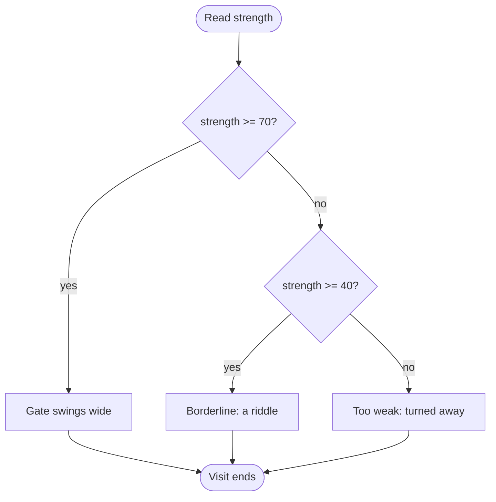
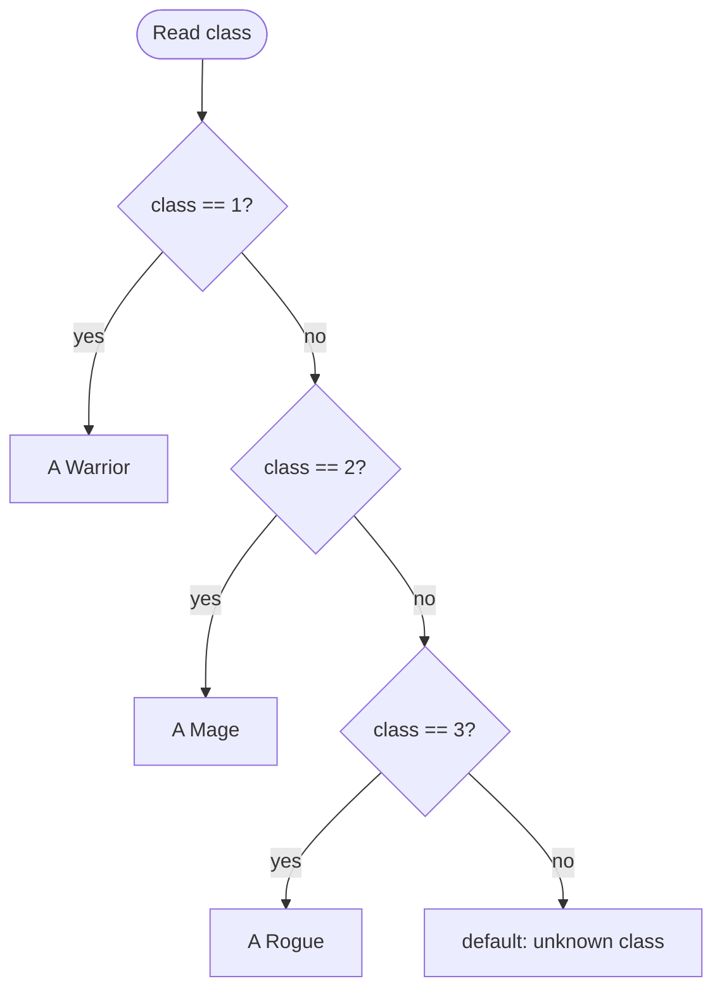

# Decisions: Teaching Your Program to Choose

## Learning Objectives

By the end of this reading, you will be able to:

- **Trace** which branch of an `if` / `else if` / `else` chain runs for a given input (MLO 4.1).
- **Implement** a `switch` statement with a `default` case for a whole-number choice (MLO 4.1).
- **Build** a boolean condition using comparison operators (`>`, `>=`, `==`, `!=`) and logical operators (`&&`, `||`, `!`) (MLO 4.2).
- **Predict** the output of a nested decision, and read a decision flowchart against the code that came from it (MLO 4.3).
- **Name** the three classic decision traps — `=` vs `==`, `switch` fall-through, and the dangling `else` — as **Logic** errors, before they bite you.

## Why This Matters

Every program you wrote in M3 ran the same way no matter what the user typed. Read some input, do some math, print the result — one straight path from the top of `main` to the bottom. Useful, but a little dumb. The program never *chose* anything.

M4 is where that changes. Since M2 you've been drawing flowcharts with **diamonds** in them — the little "yes/no" forks. This is the module where those diamonds become real code that actually forks. Same input, same program, but now different answers send the program down different roads.

This is also where the course starts talking about **filters**: conditionally processing input, letting some values through and turning others away. That idea runs all the way up to your capstone. And you'll meet it again in every language you touch in a four-year program — the keywords change, the fork does not.

> **🔗 Connection**: Our running scene is a **dungeon gatekeeper**. She stands at a door, sizes you up, and decides whether you get through. That is a filter with a story wrapped around it. The scene reskins cleanly — a nightclub bouncer checking IDs, a loan officer reading an application, an airport gate agent. The *decisions* stay exactly the same. If you swap the story and the logic breaks, the story was welded on too tight. It should peel off like a sticker.

## The Core Concept

### One fork: `if` / `else`

The simplest decision does one thing when a condition is true and another when it is false.

```cpp
if (strength >= 70)
{
    cout << "The gate swings wide.\n";
}
else
{
    cout << "Turned away.\n";
}
```

The thing in the parentheses is a **condition** — an expression that is either true or false. If it is true, the first block runs. Otherwise the `else` block runs. Exactly one of them runs, never both.

### The gatekeeper measures you: `if` / `else if` / `else`

Two outcomes are rarely enough. The gatekeeper has three answers ready — pass, maybe, and no — depending on how strong you are. You chain the checks with `else if`.

**Predict first.** Read this complete program. If the player types `55`, what prints? Write your guess down before you scroll.

```cpp
// learn-gate-strength.cpp — Stage A
#include <iostream>
using namespace std;

int main()
{
    int strength = 0;                 // a whole number, 0 to 100
    cout << "Your strength score (0-100): ";
    cin >> strength;

    if (strength >= 70)
    {
        cout << "The gate swings wide. Go through.\n";
    }
    else if (strength >= 40)
    {
        cout << "Borderline. Answer my riddle and the gate is yours.\n";
    }
    else
    {
        cout << "Too weak. Turned away.\n";
    }

    return 0;
}
```

<details>
<summary>Reveal the output (input: 55)</summary>

```
Your strength score (0-100): Borderline. Answer my riddle and the gate is yours.
```

Here's the part people miss: `55` is `>= 40`. But it's *also* checked against `>= 70` **first** — and that check was false. So we fell through to the second test. A chain is checked **top to bottom, and it stops at the first true branch.** Order matters. Put `strength >= 40` first instead, and `70` would match it before the `>= 70` line ever got a look. That branch would become unreachable — a **Logic** error: did what you said, not what you meant.
</details>

### Comparison operators, quick reference

The condition is built from comparisons. These six are your whole toolkit in M4:

| Operator | Means | Example |
|---|---|---|
| `>` | greater than | `gold > 50` |
| `<` | less than | `health < 20` |
| `>=` | greater than or equal | `strength >= 70` |
| `<=` | less than or equal | `enemies <= 3` |
| `==` | **equal to** (two equals!) | `characterClass == 3` |
| `!=` | not equal to | `answer != 0` |

### A decision, drawn

Here is the strength chain as a flowchart — the same diamonds you have been drawing since M2, now backing real code. Read it top to bottom and match each diamond to an `else if` above.



Notice the shape: each diamond has exactly two exits, and every path lands at the same end. That is what a clean `if` / `else if` / `else` chain looks like on paper. In the **Apply** tutorial you'll draw one of these *before* you type any code, and in **Assess** you'll be graded on whether your flowchart and your code tell the same story.

### Many exact matches: `switch`

A chain of `else if`s comparing the *same* variable against a list of *exact* values gets noisy. When you are matching one whole number against fixed choices — a menu, a class number — `switch` says it more cleanly. The gatekeeper's first question is exactly this shape.

```cpp
// learn-gate-class.cpp — Stage B
#include <iostream>
using namespace std;

int main()
{
    int characterClass = 0;   // 1 = Warrior, 2 = Mage, 3 = Rogue
    cout << "Your class? (1 = Warrior, 2 = Mage, 3 = Rogue): ";
    cin >> characterClass;

    switch (characterClass)
    {
        case 1:
            cout << "\"A Warrior. Strong arms, I hope.\"\n";
            break;
        case 2:
            cout << "\"A Mage. A sharp mind, I hope.\"\n";
            break;
        case 3:
            cout << "\"A Rogue. Hands where I can see them.\"\n";
            break;
        default:
            cout << "\"I do not know that class. Off you go.\"\n";
    }

    return 0;
}
```

**Program Output** (input: `2`):

```
Your class? (1 = Warrior, 2 = Mage, 3 = Rogue): "A Mage. A sharp mind, I hope."
```

**Program Output** (input: `9`):

```
Your class? (1 = Warrior, 2 = Mage, 3 = Rogue): "I do not know that class. Off you go."
```

Three parts to notice: `case 1:` is the value to match, `break;` stops the switch so it does not keep going, and `default:` is the catch-all when nothing matched — the gatekeeper's answer for a class she does not recognize. **Always give a `switch` a `default`.** It is the safety net for input you did not plan for. (Hold onto that `break;` — it is Trap 2 below.)

### Combining conditions: `&&`, `||`, `!`

Sometimes one comparison is not enough. A middling Rogue can still slip through *if she is strong enough* **and** *she brought a lockpick*. Two conditions, both required. That is `&&` (AND).

| Operator | Name | True when |
|---|---|---|
| `&&` | AND | **both** sides are true |
| `\|\|` | OR | **at least one** side is true |
| `!` | NOT | flips true to false |

```cpp
// Both must be true:
if (strength >= 40 && hasLockpick)

// At least one is enough:
if (characterClass == 1 || characterClass == 2)

// Flip it — true when NOT locked:
if (!isLocked)
```

> **⚠️ Common Pitfall**: You can't write `if (strength >= 40 && >= 70)`. Each side of `&&` must be a full condition with its own variable: `if (strength >= 40 && strength <= 70)`. Leaving out the second `strength` is a **Static semantic** error — grammar fine, meaning impossible. The program won't compile until you fix it.

### Nested conditions and the whole gate

"Nested" just means one decision lives *inside* another. Only a Rogue is even asked about a lockpick, so that question sits inside the `if (characterClass == 3)` block. Here is the full scene — Stage C — putting the switch, the nesting, the compound `&&`, and the outcome chain together.

**Predict first.** The player is a **Rogue** (class `3`), strength `55`, and answers `1` (yes, has a lockpick). Which single line of outcome prints? Guess before you scroll.

```cpp
// learn-gate-full.cpp — Stage C (abridged; full file in code/)
    bool hasLockpick = false;
    if (characterClass == 3)          // nested: only a Rogue is asked
    {
        int answer = 0;               // 1 = yes, anything else = no
        cout << "Do you carry a lockpick? (1 = yes, 0 = no): ";
        cin >> answer;
        hasLockpick = (answer == 1);
    }

    if (strength >= 70)
    {
        cout << "The gate swings wide. Go through.\n";
    }
    else if (strength >= 40 && hasLockpick)   // compound: BOTH must be true
    {
        cout << "Not strong, but those clever hands might do.\n";
    }
    else if (strength >= 40)
    {
        cout << "Borderline. Answer my riddle and the gate is yours.\n";
    }
    else
    {
        cout << "Too weak, and no trick to make up for it. Turned away.\n";
    }
```

<details>
<summary>Reveal the output (Rogue, strength 55, lockpick yes)</summary>

```
Not strong, but those clever hands might do.
```

`55 >= 70` is false, so we skip the first branch. Then `55 >= 40 && hasLockpick` — `55 >= 40` is true **and** `hasLockpick` is true, so the whole compound is true, and this branch wins. The chain stops here; the plain `>= 40` branch below never gets a look. Change that answer to `0` and the lockpick branch fails, so the *next* branch — the plain riddle — runs instead. Same strength, different ending, because of one condition. That is the whole point of M4.
</details>

The complete, runnable program lives at `modules/m4/code/learn-gate-full.cpp`.

## Three Traps, Named Out Loud

These three are the classic decision bugs. This course doesn't spring traps on you as "gotchas" — we name them here, out loud. That way, when one bites in lab, you recognize it instead of losing an afternoon. All three are **Logic** errors: the program did exactly what you said, not what you meant.

### Trap 1: `=` vs `==`

One equals sign **assigns**. Two equals signs **compare**. Inside an `if`, you almost always want two.

```cpp
if (strength = 70)   // BUG: this ASSIGNS 70 to strength, then the if is "true"
```

That line sets `strength` to `70` and then treats the result as true — so the branch runs *every time*, no matter what the player typed. The good news: the compiler is watching. Under `-Wall` it prints a warning like *"suggest parentheses around assignment used as truth value [-Wparentheses]"* and even suggests `==`. That warning is exactly why the course compiles with `-Wall -Wextra` and demands zero warnings. **Fix:** use `==`. Memory hook: *one equals gives, two equals asks.*

### Trap 2: `switch` fall-through

Every `case` needs its own `break;`. Forget it, and the program keeps running straight into the *next* case.

```cpp
switch (characterClass)
{
    case 1:
        cout << "\"A Warrior.\"\n";
        // BUG: no break here!
    case 2:
        cout << "\"A Mage.\"\n";
        break;
    ...
}
```

**Predict:** the player is class `1` (a Warrior). What prints?

<details>
<summary>Reveal</summary>

```
"A Warrior."
"A Mage."
```

Both. With no `break` after `case 1`, control "falls through" into `case 2` and runs it too.

The good news: our build flags catch this one. You'll see

```
warning: this statement may fall through [-Wimplicit-fallthrough=]
```

followed by a `note: here` pointing at the `case 2:` line — the compiler showing you both where control falls *from* and where it falls *to*. Under our zero-warning rule that's a failed build, which is exactly what you want: it stops before the wrong output ever reaches you.

The catch is that it **still produces a program**. A warning is not an error, so the build "succeeded" enough to run, and it will happily print both lines if you let it. That's what makes fall-through a **Logic** error rather than a Syntax one: the grammar was fine, the program ran, it just did what you said instead of what you meant. **Fix:** put a `break;` at the end of every case.
</details>

### Trap 3: the dangling `else`

Without braces, an `else` pairs with the **nearest** `if` — not the one your indentation seems to point at.

```cpp
if (strength >= 40)
    if (hasLockpick)
        cout << "Clever hands.\n";
else                              // looks like it pairs with the OUTER if...
    cout << "Turned away.\n";     // ...but it actually pairs with the INNER if
```

The indentation *suggests* the `else` belongs to `if (strength >= 40)`. It doesn't. It binds to `if (hasLockpick)`, the closest one. So a strong player *without* a lockpick prints "Turned away." — the opposite of what the layout implied. **Fix:** always use `{ }` braces, even for one line. Braces make the pairing explicit and this trap disappears.

> **💡 Pro Tip**: Braces on every `if`, `else if`, and `else` — always, even a single line — kills Trap 3 forever and makes Trap 1 easier to spot. It is the cheapest good habit in the module.

## Putting It Together

You now have the whole M4 toolkit. `if` / `else if` / `else` for ranges and thresholds, checked top-to-bottom and stopping at the first true branch. `switch` with a `default` for matching one number against exact choices. Comparison operators to build a single condition, and `&&` / `||` / `!` to combine them. Nesting to ask a follow-up question only when it makes sense. And three named traps that all show up as **Logic** errors.

That's exactly the gatekeeper. And the gatekeeper is exactly the diamond you've been drawing since M2 — now executable.

## Common Questions

**"What if the user types a letter where I asked for a number?"**
`cin` stops reading and the variable keeps its old value — the stream enters a "fail state." That's a **Runtime** failure (the program ran, then fell over). M4 programs assume you typed a number; M5 is where you learn to loop-until-valid and bulletproof the input. For now, test with good input and *name* the failure when you see it.

**"When do I use `switch` instead of `else if`?"**
Use `switch` when you're comparing **one** variable against a list of **exact** whole-number values (a menu, a class code). Use `else if` for **ranges** (`>= 70`, `< 40`) and for conditions that mix different variables. You can't `switch` on `strength >= 70` — a range isn't an exact value.

**"Do I have to memorize all this syntax?"**
The shapes, yes — you'll type them enough that they stick. The exact operator list, no; keep the tables above open while you work. Reading fluency matters more than recall.

**"Can I just ask AI to write the branches?"**
For *explaining* a branch you're stuck on, yes — that's a fine use of the AI ladder. But you'll be graded on whether *you* can trace which branch runs and read the flowchart against the code. You can't supervise code you can't read, and Assess will ask you to read it. If you use AI, record it in `prompts.md`.

## Check Yourself

**1. Trace it.** In the Stage A program (`learn-gate-strength.cpp`), the player types `40`. What prints?

<details>
<summary>Answer</summary>

`Borderline. Answer my riddle and the gate is yours.` — `40 >= 70` is false, but `40 >= 40` is true (the `>=` includes 40 exactly), so the middle branch runs.
</details>

**2. Classify the error.** A student writes `if (answer = 1)` inside their gate. It compiles (with a warning) and the branch runs every single time. Which of the four error types is this — Syntax, Static semantic, Runtime, or Logic?

<details>
<summary>Answer</summary>

**Logic.** It compiled and ran. It just did what was written — assign `1`, always true — instead of what was meant — compare to `1`. The `-Wall` warning is the compiler trying to save you from a Logic bug.
</details>

**3. Recover the flowchart.** Read the `switch` in `learn-gate-class.cpp` and sketch its flowchart on paper: one entry, one diamond per class, and where `default` goes. (This "code back to a diagram" move is graded later in the module — practice it now.)

<details>
<summary>Answer (one valid shape)</summary>



A `switch` is really a stack of exact-match diamonds with `default` as the final "none of these" exit.
</details>

## Next Steps

1. **Take the M4 exit ticket** (Practice). It's short, low-stakes, and completion-gated — a few trace-which-branch and classify-the-error items just like Check Yourself above. It confirms you can read a decision before you write one.
2. **Bring this reading to class for the Apply tutorial.** You'll draw the gatekeeper's flowchart first, then type the whole program in yourself, one compiling stage at a time — the same Stage A → B → C build you just read.
3. **Optional deeper dive:** the `thinkcpp` chapter on conditionals and the `switch` page on cppreference, if you want a second voice on the same ideas.
