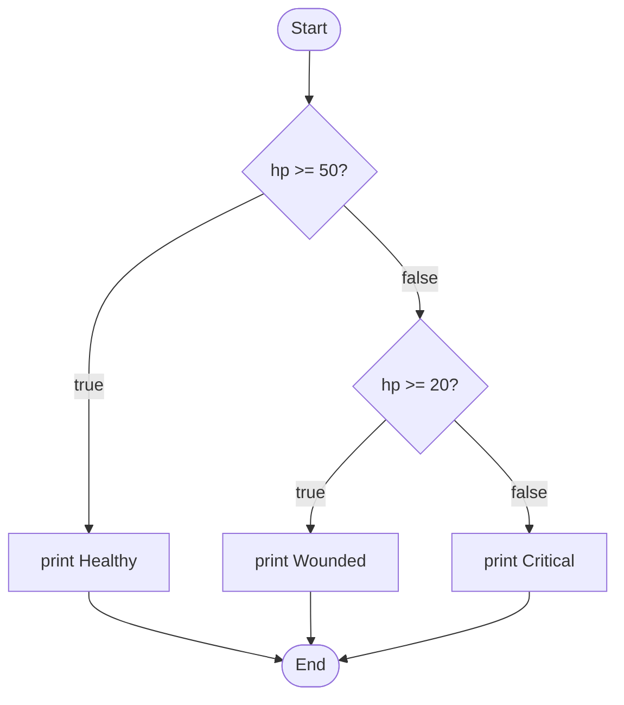
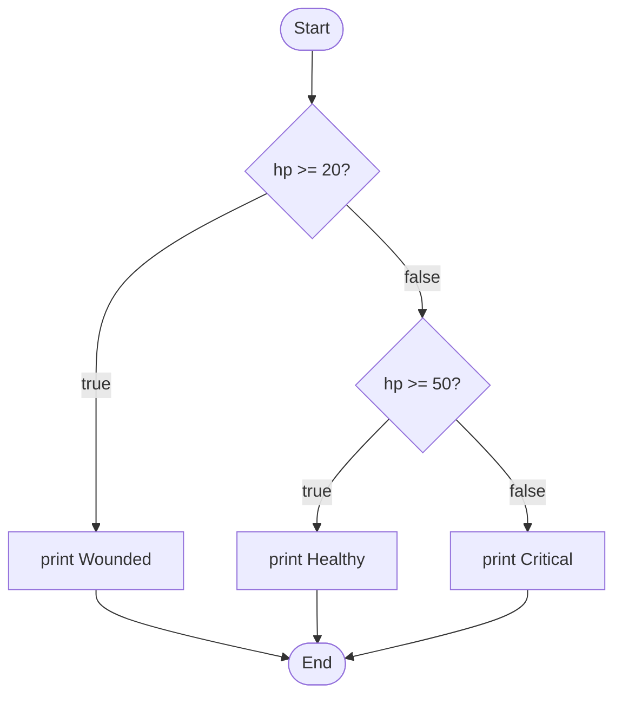
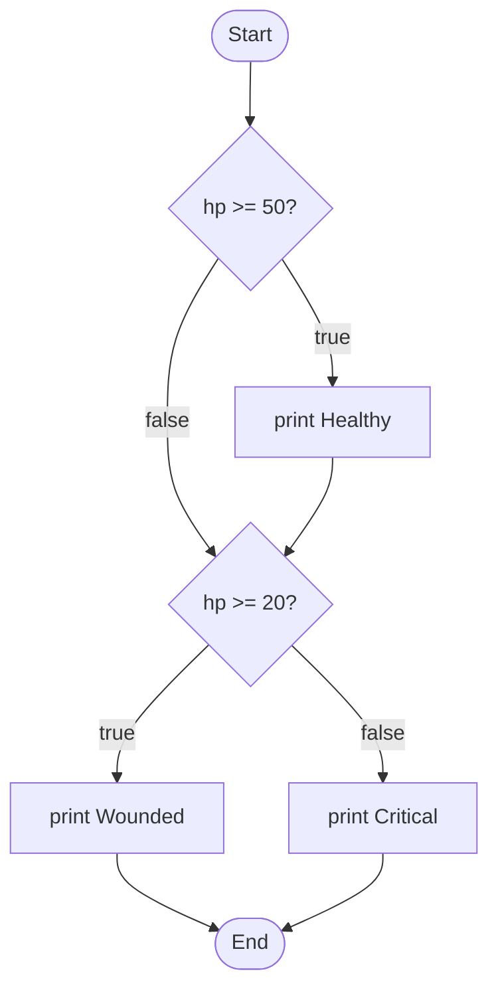

# Module 4 Exit Ticket: Decisions — Which Branch Runs?

This is a checkpoint, not a test. Finish it and you move on to the Apply
tutorial. Wrong answers cost you nothing — they just tell us both what to
review before you start writing decision code yourself. **No trick questions,
ever.**

You'll read code and predict what it does. You won't write any code here.
That comes next, in Apply.

The scene is a dungeon gatekeeper deciding who gets through the door. If a
dungeon isn't your thing, the same logic works for a nightclub bouncer, an
airport gate agent, or a loan officer — the *decisions* are what we're
checking, not the theme.

---

## Item 1 — Warm-up: predict the output

What does this program print?

```cpp
#include <iostream>
using namespace std;

int main()
{
    int gold = 45;

    if (gold >= 50)
        cout << "You may enter the treasure vault.\n";
    else
        cout << "Not enough gold. Come back richer.\n";

    return 0;
}
```

- A) `You may enter the treasure vault.`
- B) `Not enough gold. Come back richer.`
- C) Both lines print, one after the other.
- D) It does not compile.

---

## Item 1.5 — Bridge: trace a two-branch chain

Item 1 had one `if` and one `else`. This one puts a **second check** in the
middle — an `else if` — before deciding. What does it print?

```cpp
#include <iostream>
using namespace std;

int main()
{
    int mana = 30;

    if (mana >= 50)
        cout << "You cast the great spell.\n";
    else if (mana >= 20)
        cout << "You cast a minor spell.\n";

    return 0;
}
```

Filling in this trace table may help you decide (it's a scratchpad, not
graded — the last question is what counts):

| Check, in order | True or false with `mana` = 30? |
|-----------------|---------------------------------|
| `mana >= 50`    |                                 |
| `mana >= 20`    |                                 |

**Which line prints?**

- A) `You cast the great spell.`
- B) `You cast a minor spell.`
- C) Both lines print, one after the other.
- D) Nothing prints.

---

## The gatekeeper program (used in Items 2, 3, and 6)

Read this once. The next few items ask different questions about it. It reads a
character class, then a strength score, and for a Rogue it also asks about a
lockpick. Then it decides.

```cpp
#include <iostream>
using namespace std;

int main()
{
    int characterClass = 0;   // 1 = Warrior, 2 = Mage, 3 = Rogue
    cout << "Class? (1=Warrior, 2=Mage, 3=Rogue): ";
    cin >> characterClass;

    switch (characterClass)
    {
        case 1:
            cout << "A Warrior steps up.\n";
            break;
        case 2:
            cout << "A Mage steps up.\n";
            break;
        case 3:
            cout << "A Rogue steps up.\n";
            break;
        default:
            cout << "Unknown class. The gate stays shut.\n";
            return 0;
    }

    int strength = 0;         // a whole number, 0 to 100
    cout << "Strength (0-100): ";
    cin >> strength;

    bool hasLockpick = false;
    if (characterClass == 3)
    {
        int answer = 0;       // 1 = yes, anything else = no
        cout << "Lockpick? (1=yes, 0=no): ";
        cin >> answer;
        hasLockpick = (answer == 1);
    }

    if (strength >= 70)
    {
        cout << "The gate swings wide. Go through.\n";
    }
    else if (strength >= 40 && hasLockpick)
    {
        cout << "Clever hands will do. You slip inside.\n";
    }
    else if (strength >= 40)
    {
        cout << "Borderline. Answer the riddle to pass.\n";
    }
    else
    {
        cout << "Too weak. Turned away.\n";
    }

    return 0;
}
```

---

## Item 2 — Trace the branch

A player runs the gatekeeper program above and types:

- Class: `1` (Warrior)
- Strength: `55`

Filling in this trace table may help you decide (it's a scratchpad, not
graded — the last question is what counts):

| Check, in order         | True or false with these inputs? |
|-------------------------|----------------------------------|
| `strength >= 70`        |                                  |
| `strength >= 40 && hasLockpick` |                          |
| `strength >= 40`        |                                  |

**Which line is the final outcome that prints?**

- A) `The gate swings wide. Go through.`
- B) `Clever hands will do. You slip inside.`
- C) `Borderline. Answer the riddle to pass.`
- D) `Too weak. Turned away.`

---

## Item 3 — Trace the branch with `&&`

A different player runs the same gatekeeper program and types:

- Class: `3` (Rogue)
- Strength: `50`
- Lockpick: `1` (yes)

Filling in this trace table may help you decide (it's a scratchpad, not
graded — the last question is what counts):

| Check, in order         | True or false with these inputs? |
|-------------------------|----------------------------------|
| `strength >= 70`        |                                  |
| `strength >= 40 && hasLockpick` |                          |
| `strength >= 40`        |                                  |

**Which line is the final outcome that prints?**

- A) `The gate swings wide. Go through.`
- B) `Clever hands will do. You slip inside.`
- C) `Borderline. Answer the riddle to pass.`
- D) `Too weak. Turned away.`

---

## Item 4 — Predict the output (`switch`)

What does this program print?

```cpp
#include <iostream>
using namespace std;

int main()
{
    int door = 3;

    switch (door)
    {
        case 1:
            cout << "Treasure!\n";
            break;
        case 2:
            cout << "A healing fountain.\n";
            break;
        default:
            cout << "You walk into a wall.\n";
    }

    return 0;
}
```

- A) `Treasure!`
- B) `A healing fountain.`
- C) `You walk into a wall.`
- D) Nothing prints, because there is no `case 3`.

---

## Item 5 — Classify the error

This program **compiles and runs** with no error message. The author wanted it
to print **only** the red-potion line when `potion` is `1`. Instead it prints
both potion lines.

```cpp
#include <iostream>
using namespace std;

int main()
{
    int potion = 1;   // author wants ONLY the red-potion line to print

    switch (potion)
    {
        case 1:
            cout << "Red potion: +10 health.\n";
        case 2:
            cout << "Blue potion: +10 mana.\n";
            break;
        default:
            cout << "No potion.\n";
    }

    return 0;
}
```

Using the course's four error names, this is a:

- A) **Syntax** error (broke the grammar)
- B) **Static semantic** error (grammar fine, meaning impossible)
- C) **Runtime** error (ran, then fell over)
- D) **Logic** error (did what you said, not what you meant)

---

## Item 6 — Which line must change?

Here is the outcome section of the gatekeeper program, with line numbers:

```text
1   if (strength >= 70)
2   {
3       cout << "The gate swings wide. Go through.\n";
4   }
5   else if (strength >= 40 && hasLockpick)
6   {
7       cout << "Clever hands will do. You slip inside.\n";
8   }
9   else if (strength >= 40)
10  {
11      cout << "Borderline. Answer the riddle to pass.\n";
12  }
13  else
14  {
15      cout << "Too weak. Turned away.\n";
16  }
```

Right now, a Warrior with strength `65` gets `Borderline. Answer the riddle to
pass.` You want strength `65` (and up) to **fully pass** — to get
`The gate swings wide. Go through.` instead.

Filling in this trace table may help you see where strength `65` lands today
(it's a scratchpad, not graded — the question below is what counts):

| Check, in order                          | True or false for a Warrior, strength 65? |
|------------------------------------------|-------------------------------------------|
| `strength >= 70` (line 1)                |                                           |
| `strength >= 40 && hasLockpick` (line 5) |                                           |
| `strength >= 40` (line 9)                |                                           |

**Which line currently rejects strength 65 — the line whose threshold must be
lowered?** (You do not have to write the new line — just name which one to
change.)

- A) Line 1
- B) Line 5
- C) Line 9
- D) Line 13

---

## Item 7 — Match the code to its flowchart

This code chooses exactly one status to print, based on `hp`:

```cpp
if (hp >= 50)
    cout << "Healthy\n";
else if (hp >= 20)
    cout << "Wounded\n";
else
    cout << "Critical\n";
```

**Which flowchart matches this code?**

**Flowchart A**



**Flowchart B**



**Flowchart C**



- A) Flowchart A
- B) Flowchart B
- C) Flowchart C

---

*That's the whole ticket. Once you've worked through every item, you're cleared
for the Apply tutorial, where you'll type in a decision program of your own.*
